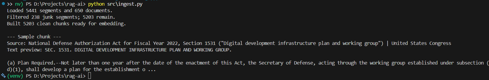
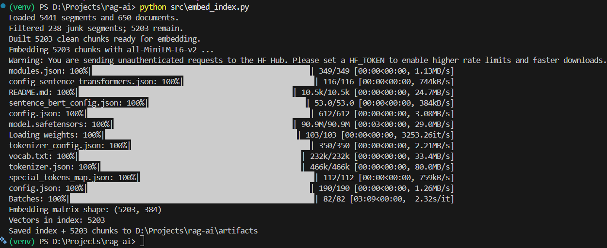
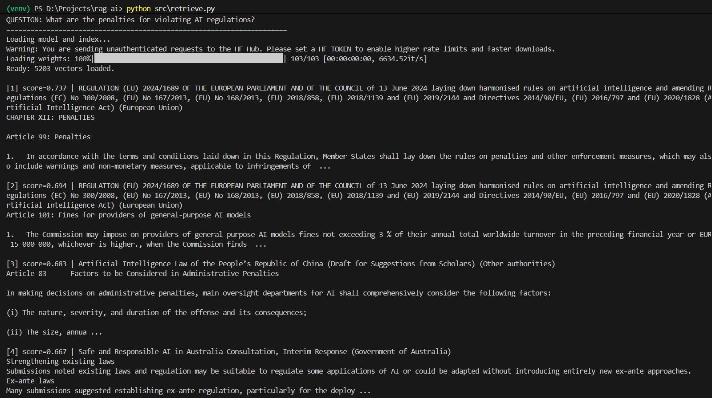
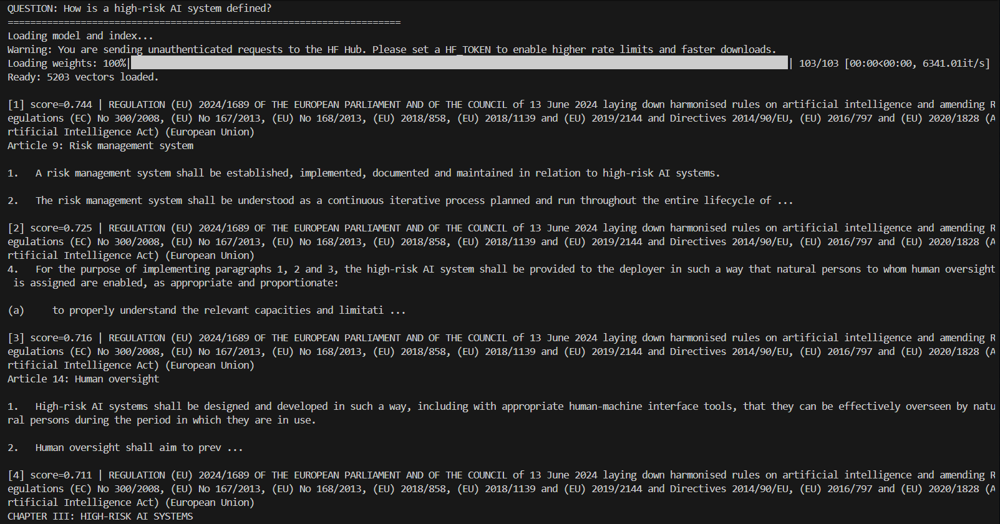
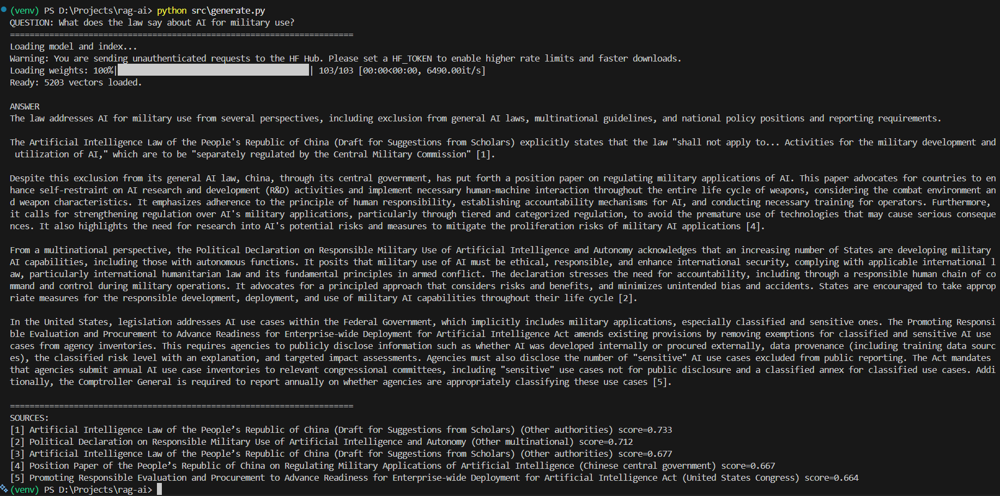
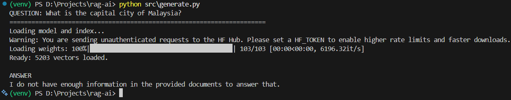
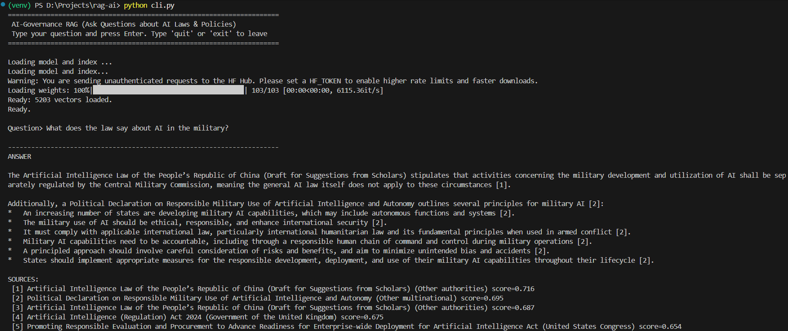
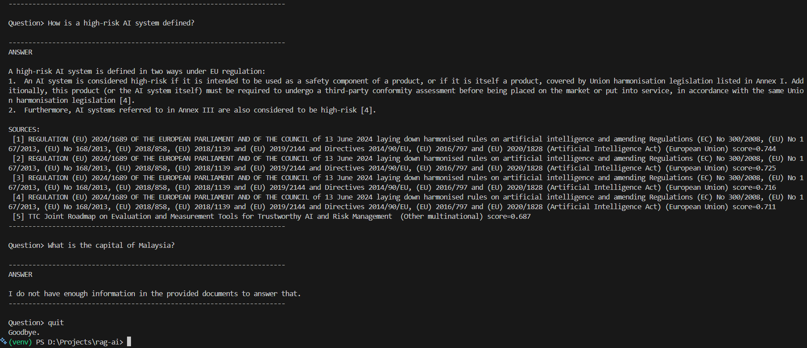

<div align="center">

# 🏛️RAG over AI-Governance Documents

> A retrieval-augmented question-answering system over the [AGORA AI corpus](https://www.kaggle.com/datasets/umerhaddii/ai-governance-documents-data). 

> Ask questions about AI laws and policies, get answers grounded in the actual source text with every claim cited back to the document it came from.

</div>

---

## ✨Overview

LLM answers from memory, which means they can confidently make things up. This system avoids that by retrieving the most relevant passages from a corpus of real AI-governance documents first, then asking the LLM to answer using only those passages and to say *"I don't know"* when the corpus doesn't cover that question.

The corpus is the AGORA dataset, which is roughly 650 AI laws, bills, executive orders and policy frameworks worldwide, segmented into roughly 5,400 sections with metadata.

---

## ⚙️How the RAG System Works

```
Ingest → Embed & Index → Retrieve → Generate → Answer + Citations
```

The RAG system has two parts.

**Ingestion (run once):**

1. Load the dataset's `segments.csv` (text) and `documents.csv` (metadata), join them so every text chunk carries its parent law's name and authority.
2. Drop out segments flagged non-operative or not-AI-related (around 238 segments), leaving  about 5,203 clean chunks.
3. Embed each chunk into a 384-dimension vector with `all-MiniLM-L6-v2` embedding model.
4. Store the vectors in a `FAISS` index and save it to disk.

**Querying (per question):**

1. Embed the question with the **same** embedding model.
2. Use `FAISS` to retrieve the top-k most similar chunks (semantic nearest-neighbour search, kNN).
3. If the best match scores below a relevance threshold, return "I don't know" without calling the LLM.
4. Otherwise, build a grounded prompt containing the retrieved chunks and send it to the LLM.
5. Return the answer plus the source documents it was grounded in.

---

### 🔎RAG Pipeline
 
#### 1.Ingestion
Loads `segments.csv` + `documents.csv`, joins them, and filters out non-operative/not-AI-related segments, leaving **5,203 clean chunks**, each tagged with its source law and authority.
 

 
#### 2.Embedding & Indexing
Each chunk becomes a 384-dimension vector via `all-MiniLM-L6-v2`, stored in a `FAISS` index and saved to disk (`build once, load many`).
 

 
#### 3.Retrieval
A question is embedded with the *same* embedding model and `FAISS` returns the most semantically similar segments. Note how it shows the **EU AI Act**, it is matching on *meaning*, not keywords.
 




#### 4.Grounded Generation
The retrieved segments are passed to LLM (Gemini) with a prompt that enforces grounding: *answer only from context, cite sources, refuse if unsure.* The result synthesises across **multiple jurisdictions (countries)** with inline citations.
 

 
When the corpus cannot answer, the system declines instead of guessing to proof that grounding works.
 

 
#### 5.Interactive CLI
Loads everything once, then answers questions live until you type `quit` or `exit`.
 




---

## 🧩Design Decisions

| Decisions | Justifications |
|---|---|
| **Built from ground up, no framework** | Deliberately did not use LangChain or LlamaIndex, instead build the pipeline directly (load → chunk → embed → index → retrieve → generate) so I may learn and understand how RAG works. |
| **Used the dataset's existing segmentation instead of re-chunking** | The dataset provides expert pre-segmented chunks with metadata. Used these rather than re-chunking the raw fulltext because each segment is a self-contained legal provision, thus by re-splitting would destroy that structure and discard the provided summaries and flags. The raw fulltext files do exit, but chose the pre-segmented version on purpose to save time and effort. |
| **Embedded full segment text, not summaries** | Each segment has both full text and a summary. Decided to embedd the full text because that is the actual content users' questions are about. |
| **`all-MiniLM-L6-v2` as the embedding model** | A small, fast, free and widely-used embedding model that runs locally with no cost. The tradeoff is that maybe a larger or legal-domain model could improve retrieval quality as it is for more general purpose embedding, but MiniLM is fast to iterate with and more than enough to validate the pipeline works. Other, more suitable models can be swapped by changing one line. |
| **FAISS instead of a full vector database** | At around 5000 vectors with a read-only workload, a full database like Chroma or Pinecone adds setup and server overhead with no benefit. `FAISS` is a flat, exact vector index, plus a pickle file for metadata keeps the RAG lightweight and runnable with no external, paid services. |
| **Filter junk segments before joining metadata** | Removing non-operative and not-AI-related segments improves retrieval precision and filtering before the join is keeps the pipeline cleaner. |
| **Grounding enforced through prompt design** | The prompt instructs the model to answer only from the retrieved context, cite sources by number and explicitly refuse when the context is insufficient. This is the main anti-hallucination mechanism. |
| **Retrieval relevance threshold (0.3)** | If the best-matching chunk scores below 0.3, the system returns "I don't have enough information" without calling the LLM. This threshold was chosen from the observed score gap between relevant queries (0.65+) and irrelevant ones (0.25). It prevents misleading citations and saves an unnecessary API call. |
| **Prompt tuned for multi-source synthesis** | Rather than answering from the single best match, the prompt instructs the model to synthesise across all relevant retrieved sources and compare across countries, jurisdictions where applicable, thus producing a more complete, multi-source answers while still grounding every claim and avoiding context (padding). |
| **Gemini as the LLM** | Gemini 2.5 Flash through Google AI Studio is free tier and does not require any cards. However, the tradeoff is that the free-tier inputs may be used by Google to improve their products, which is acceptable in this case here since the corpus is already publicly available on Kaggle, but more sensitive and private data would require the paid tier or use a local model. |

---

## ⚠️Limitations

| Knowns Issues | Explanations |
|---|---|
| **Retrieval ranking** | A general-purpose embedding model like `all-MiniLM-L6-v2` captures general semantic relevance well, but may not always rank the single most specific or most relevant provision (laws) first. A more targeted legal-domain embedding model would likely improve this. |
| **Very long segments** | A few segments run up to about 5,000 words, which exceeds the embedding model's input window and gets truncated. Therefore, these long segments are embedded only partially.
| **Evaluation is difficult & manual** | Like sentiment analysis needs accuracy/F1 to be validated, RAG requires verifying whether the retrieved context is truly relevant and that the answer is actually grounded. This is harder because there are no ground-truth labels, so quality of the answer is assessed manually and subjectively. |
| **Free-tier rate limits** | Gemini's free tier is rate-limited to about 10 requests/min, which is suitable for interactive use and demos, but not high throughput.
| **No conversation memory** | Each question is answered independently, so there is no follow-up or multi-turn context. |

---

## 🚀How to Run the Code

### 1.Requirements

- Python 3.10+
- A free [Google AI Studio](https://aistudio.google.com/app/apikey) API key for Gemini

### 2.Install

```bash
python -m venv venv
# Windows:
.\venv\Scripts\Activate
# macOS/Linux:
source venv/bin/activate

pip install -r requirements.txt
```

### 3.API Key

Create a `.env` file in the project root:

```
GEMINI_API_KEY=your_key_here
```

(`.env` file is gitignored and never committed)

### 4.Get the Data

The dataset is not included in this repo. Download it from the [AGORA AI-governance dataset on Kaggle](https://www.kaggle.com/datasets/umerhaddii/ai-governance-documents-data) and place these files in a `data/` folder in the project root:

```
data/
├── segments.csv
├── documents.csv
├── authorities.csv
└── collections.csv
```

(`segments.csv` and `documents.csv` are used)

### 5.Build the Index

```bash
python src/embed_index.py
```

This embeds all chunks and saves the `FAISS` index to `artifacts/`. It takes a few minutes and only needs to be run once.

### 6.Ask Questions

```bash
python cli.py
```

---

## 📁Project Structure

```
rag-ai/
├── cli.py                  # interactive question loop
├── requirements.txt
├── README.md
├── src/
│   ├── ingest.py           # load, filter, join the CSVs
│   ├── embed_index.py      # embed chunks, build & save FAISS index
│   ├── retrieve.py         # embed query, search the index
│   ├── llm.py              # LLM 
│   └── generate.py         # grounded prompt + answer assembly
├── data/                   # dataset (gitignore)
└── artifacts/              # FAISS index + metadata (gitignored)
```